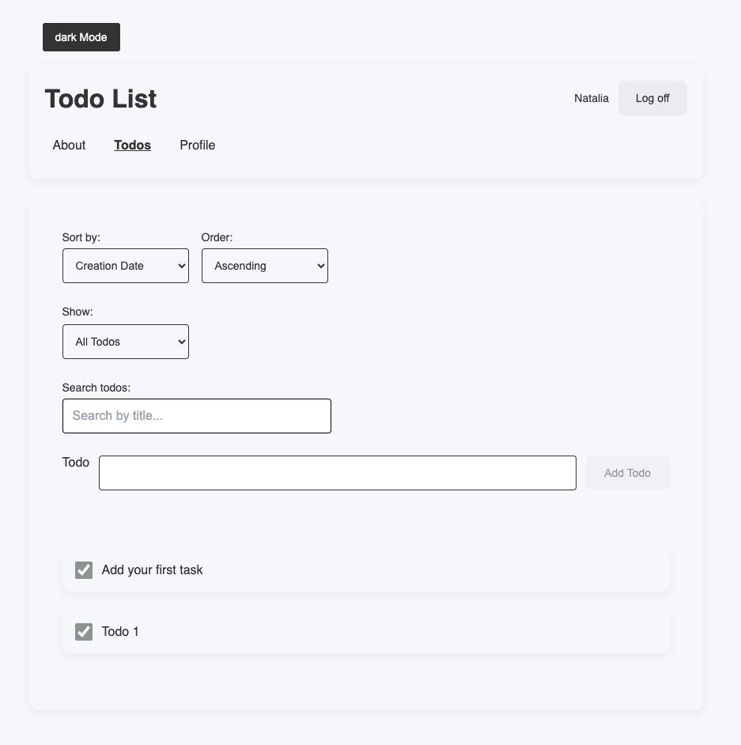
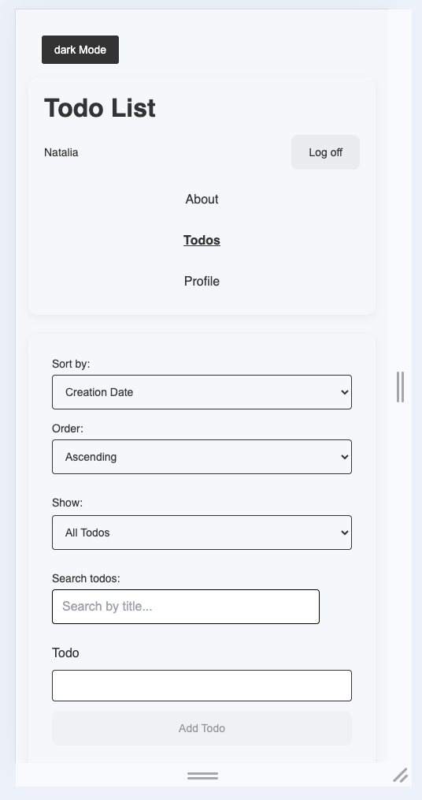

# Todo List

A modern todo application built with Vite and React, featuring user authentication, task management, filtering, sorting, and responsive design.
This project demonstrates proficiency in React hooks, reducer-based state management, component architecture, API integration, and protected routing.

## Live Demo

Coming soon.

## Technologies Used

- **Frontend:** React 19, React Router, CSS Modules
- **State Management:** useReducer, Context API
- **Build Tool:** Vite
- **Deployment:** Vercel

## Screenshots




## Project Structure

```text
├── README.md
├── eslint.config.js
├── index.html
├── package-lock.json
├── package.json
├── public
│   ├── favicon.svg
│   └── icons.svg
├── src
│   ├── App.jsx
│   ├── App.module.css
│   ├── assets
│   │   ├── hero.png
│   │   ├── react.svg
│   │   └── vite.svg
│   ├── components
│   │   └── RequireAuth.jsx
│   ├── contexts
│   │   └── AuthContext.jsx
│   ├── features
│   │   ├── Logoff.jsx
│   │   ├── Logoff.module.css
│   │   └── Todos
│   ├── hooks
│   │   └── useEditableTitle.js
│   ├── index.css
│   ├── main.jsx
│   ├── pages
│   │   ├── AboutPage.jsx
│   │   ├── HomePage.jsx
│   │   ├── LoginPage.jsx
│   │   ├── NotFoundPage.jsx
│   │   ├── Pages.module.css
│   │   ├── ProfilePage.jsx
│   │   └── TodosPage.jsx
│   ├── reducers
│   │   └── todoReducer.js
│   ├── shared
│   │   ├── FilterInput.jsx
│   │   ├── FilterInput.module.css
│   │   ├── Header.jsx
│   │   ├── Header.module.css
│   │   ├── Navigation.jsx
│   │   ├── Navigation.module.css
│   │   ├── SortBy.jsx
│   │   ├── SortBy.module.css
│   │   ├── StatusFilter.jsx
│   │   ├── StatusFilter.module.css
│   │   ├── TextInputWithLabel.jsx
│   │   └── TextInputWithLabel.module.css
│   └── utils
│       ├── todoValidation.js
│       └── useDebounce.js
└── vite.config.js
```

## Features

- User login
- User logout
- Protected todo list page
- Add new todos
- Edit existing todos
- Delete todos
- Mark todos as completed
- Sort todos by title
- Sort todos by creation date
- Filter todos by search term
- Todo statistics on the profile page
- Total, completed, and active todo count
- Completion percentage
- Loading and error handling
- Responsive design for mobile and desktop

## Available Scripts:

In the project directory, you can run:

```bash
npm run dev
```

Starts the development server using Vite.

```bash
npm run build
```

Builds the application for production.

```bash
npm run preview
```

## Design Decisions

This project uses CSS Modules to keep component styles scoped and organized.
The layout uses flexible widths, max-width values, flex-wrap, and media queries to support responsive design on both desktop and mobile screens.
The visual design uses a clean and simple interface with readable form fields, touch-friendly buttons, consistent spacing, and light/dark theme support.
Form inputs include validation, maximum length limits, and user-friendly error messages.

## Future Improvements

- Show the start date for each task
- Add a due date / deadline
- Add priority levels: High, Medium, Low
- Add comments or notes for each task
- Add reminders or notifications
- Add a calendar view
- Sort tasks by deadline
- Highlight overdue tasks
- Add drag-and-drop reordering
- Add subtasks or checklists

## Prerequisites

- Node.js
- npm
- Git

## Installation

1. Clone the repository from GitHub:

   ```bash
   git clone https://github.com/negonch/todo-list-1.git
   ```

2. Open the project folder in Terminal:

   ```bash
   cd todo-list-1
   ```

3. Install dependencies:

   ```bash
   npm install
   ```

## Run the project

1. Start the development server:

   ```bash
   npm run dev
   ```

2. Open http://localhost:3001/ in your browser.
   If your terminal shows a different port, use the URL shown in the terminal.

## License

This project is licensed under the MIT License.

## Contact Information

https://github.com/negonch
